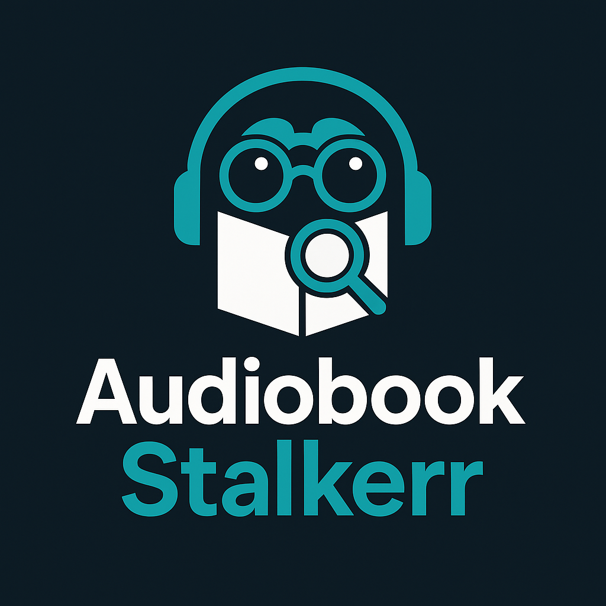

<!-- Audiobook Stalkerr README (HTML version) -->

  

<h1 align="center">Audiobook Stalkerr</h1>

<b>Track. Discover. Listen First.</b>

  <i>
    The open-source app that tracks, visualizes, and notifies you about new and upcoming audiobooks from Audible & your favorite authors—Radarr/Sonarr style.
  </i>

<h2>🚀 Features</h2>
<ul>
  <li><b>Web Dashboard:</b> Browse, search, and filter upcoming releases in a responsive, mobile-friendly web UI</li>
  <li><b>Author & Series Tracking:</b> Automatically search Audible for new audiobooks by your favorite authors and series</li>
  <li><b>Multi-Match Processing:</b> Identifies and processes all matching audiobooks above a confidence threshold (multiple volumes, editions, etc.)</li>
  <li><b>Notifications:</b> Get notified via Pushover, Discord, and Email when new releases are found</li>
  <li><b>Calendar Integration:</b> Export upcoming releases as iCalendar (.ics) files for your calendar app</li>
  <li><b>Configurable:</b> YAML-based configuration with environment variable support for secrets and API keys</li>
  <li><b>Database Storage:</b> Local SQLite database tracks audiobooks, notification status, and cleans up released books automatically</li>
  <li><b>Batch & Manual Modes:</b> Run as a scheduled job or interactively via the web UI</li>
  <li><b>Dark Mode & Accessibility:</b> Fully accessible, dark mode ready, and keyboard navigable</li>
</ul>

<h2>📸 Live Demo</h2>

  

<i>Browse and track all your upcoming audiobooks in a beautiful, mobile-friendly UI.</i>

<h2>🖥️ Web UI</h2>
<ul>
  <li><b>Upcoming Releases:</b> See all tracked upcoming audiobooks, grouped by month, with cover art, series, narrator, publisher, and Audible links</li>
  <li><b>iCal Export:</b> Download a calendar event for any release (00:00 America/Los_Angeles)</li>
  <li><b>Search & Filter:</b> Instantly search by title, author, series, or narrator; filter by author or date</li>
  <li><b>Statistics:</b> See stats on authors, publishers, and recent additions</li>
  <li><b>Configuration Page:</b> Manage your tracked authors, series, and notification settings</li>
  <li><b>Mobile Friendly:</b> Works great on phones, tablets, and desktops</li>
</ul>

<h2>⚙️ Installation</h2>
<ol>
  <li><b>Clone this repository</b></li>
  <li>
    <b>Install dependencies:</b>
    <pre><code>pip install -r requirements.txt</code></pre>
  </li>
  <li>
    <b>Configure your settings:</b>
    <ul>
      <li>Edit <code>src/audiostracker/config/config.yaml</code> for global settings</li>
      <li>Edit <code>src/audiostracker/config/audiobooks.json</code> to specify authors/series to track</li>
      <li>Create a <code>.env</code> file in <code>src/audiostracker/config</code> with your API keys and credentials</li>
    </ul>
  </li>
  <li>
    <b>Run the web UI:</b>
    <pre><code>python start_webui.py
# or
uvicorn src.audiostracker.web.app:app --reload</code></pre>
    Then open <a href="http://127.0.0.1:5005/" target="_blank">http://127.0.0.1:5005/</a> in your browser.
  </li>
  <li>
    <b>(Optional) Run the tracker as a script:</b>
    <pre><code>python -m src.audiostracker.main</code></pre>
  </li>
</ol>

<h2>🔔 Notifications & Integrations</h2>
<ul>
  <li><b>Pushover:</b> Real-time push notifications to your phone</li>
  <li><b>Discord:</b> Send new release alerts to your Discord server</li>
  <li><b>Email:</b> Get email notifications for new audiobooks</li>
  <li><b>Calendar:</b> Export .ics files for any release or batch</li>
</ul>

<h2>🛠️ Configuration</h2>
<ul>
  <li><b>Environment Variables:</b> Store secrets in <code>.env</code> (see example below)</li>
  <li><b>YAML &amp; JSON:</b> All settings and tracked books are editable as plain text</li>
  <li><b>Database:</b> Uses SQLite for reliability and easy backup</li>
</ul>

<h2>📦 Project Structure</h2>
<pre>
├── src/audiostracker/
│   ├── web/                # Web UI (FastAPI, templates, static files)
│   ├── config/             # YAML/JSON config files
│   ├── notify/             # Notification channels (pushover, discord, email)
│   ├── ical_export.py      # iCal export logic
│   ├── main.py             # CLI/script entrypoint
│   ├── database.py         # Database logic
│   └── ...
├── requirements.txt
├── start_webui.py
└── README.md
</pre>

<h2>📝 Example .env</h2>
<pre>
PUSHOVER_API_TOKEN=your_pushover_api_token
PUSHOVER_USER_KEY=your_pushover_user_key

# Discord

DISCORD_WEBHOOK_URL=your_discord_webhook_url

# Email

EMAIL_FROM=<audiobook-stalker@domain.com>
EMAIL_TO=<your_email@example.com>
EMAIL_USERNAME=<your_email@example.com>
EMAIL_PASSWORD=your_email_password
</pre>

<h2>📝 Example config.yaml</h2>
<pre>
# global config
cron_settings:
  enabled: true # enable cron job for periodic tasks
  cron: "0 9 * * *"  # run once a day at 09:00
  timezone: "America/Chicago" # timezone for cron job scheduling
max_results: 50 # maximum number of results to return; Audible API allows up to 50
log_level: DEBUG # options: DEBUG, INFO, WARNING, ERROR
log_format: json # options: json, text
language: "english" # default language for Audible searches (english, spanish, french, etc.)

# Web UI Configuration

web_ui:
  port: 5005 # port to run the web server on
  host: "0.0.0.0" # host to bind to (use 0.0.0.0 for all interfaces)
  reload: true # enable auto-reload for development

# Notification channels

pushover:
  enabled: true
  sound: "pushover" # default notification sound
  priority: 0 # -2 (lowest) to 2 (emergency)
  device: "" # optional: target a specific device

# user_key and api_token will be loaded from .env, not here

discord:
  enabled: false # set to true to enable Discord notifications
  webhook_url: "" # Discord webhook URL (load from .env)
  username: "Audiobook Stalkerr" # bot username
  avatar_url: "" # optional: bot avatar URL
  color: "0x1F8B4C" # embed color (hex)

email:
  enabled: true # set to true to enable email notifications
  smtp_server: "smtp.gmail.com" # SMTP server
  smtp_port: 587 # SMTP port
  use_tls: true # use TLS
  use_ssl: false # use SSL (alternative to TLS)
  from_email: "" # sender email (load from .env)
  to_emails: [] # list of recipient emails (load from .env)

# username and password will be loaded from .env, not here

rate_limits:
  audible_api_per_minute: 240 # 4 requests per second = 240 per minute (parallel async requests)
  notification_per_minute: 5 # hardcoded in code, shown here for reference
  db_ops_per_second: 20 # hardcoded in code, shown here for reference

ical:
  enabled: true # enable iCal export
  batch:
    enabled: true # enable batching of iCal exports
    max_books: 10 # maximum number of books to include in a single batch
    file_path: "data/ical_export/" # directory to save iCal files

database:
  cleanup_grace_period_days: 0 # 0 = remove books on their release date, >0 = keep for N days after release
  vacuum_interval_days: 7 # run VACUUM command every N days to optimize database size
</pre>

<h2>📝 Example audiobooks.json</h2>
<pre>
{
  "audiobooks": {
    "author": {
      "Akumi Agitogi": [
        {
          "narrator": [
            "Miranda Parkin",
            "Damien Haas"
          ],
          "publisher": "Yen audio",
          "series": "My Happy Marriage",
          "title": "My Happy Marriage"
        }
      ],
      "Aneko Yusagi": [
        {
          "narrator": [
            "Kurt Kanazawa",
            "Matthew Bridges",
            "Shea Taylor"
          ],
          "publisher": "Yen audio",
          "series": "The Rising of the Shield Hero",
          "title": "The Rising of the Shield Hero"
        }
      ]
      // ... more authors ...
    }
  }
}
</pre>

<h2>🏷️ License</h2>

MIT

